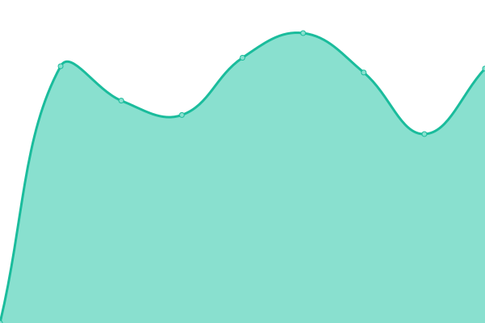

# [📈 Live Status](https://daniel-sum.github.io/uptime4): <!--live status--> **🟩 All systems operational**

This repository contains the open-source uptime monitor and status page for [daniel-sum](https://daniel-sum.github.io/uptime4), powered by [Upptime](https://github.com/upptime/upptime).

With [Upptime](https://upptime.js.org), you can get your own unlimited and free uptime monitor and status page, powered entirely by a GitHub repository. We use [Issues](https://github.com/daniel-sum/uptime4/issues) as incident reports, [Actions](https://github.com/daniel-sum/uptime4/actions) as uptime monitors, and [Pages](https://daniel-sum.github.io/uptime4) for the status page.

<!--start: status pages-->
<!-- This summary is generated by Upptime (https://github.com/upptime/upptime) -->
<!-- Do not edit this manually, your changes will be overwritten -->
<!-- prettier-ignore -->
| URL | Status | History | Response Time | Uptime |
| --- | ------ | ------- | ------------- | ------ |
|  [PS4](https://www.ps4.ro) | 🟩 Up | [ps-4.yml](https://github.com/daniel-sum/uptime4/commits/HEAD/history/ps-4.yml) | 

 2199ms
     
 | 

<a href="https://daniel-sum.github.io/uptime4/history/ps-4">99.38%</a>
    

|  [DMU](https://www.mobilitateurbana4.ro) | 🟩 Up | [dmu.yml](https://github.com/daniel-sum/uptime4/commits/HEAD/history/dmu.yml) | 

 1621ms
     
 | 

<a href="https://daniel-sum.github.io/uptime4/history/dmu">99.54%</a>
    

|  [DITL Registratura](https://registratura.taxeimpozite4.ro) | 🟩 Up | [ditl-registratura.yml](https://github.com/daniel-sum/uptime4/commits/HEAD/history/ditl-registratura.yml) | 

 1015ms
     
 | 

<a href="https://daniel-sum.github.io/uptime4/history/ditl-registratura">99.54%</a>
    

|  [SVU](https://svu.ps4.ro) | 🟩 Up | [svu.yml](https://github.com/daniel-sum/uptime4/commits/HEAD/history/svu.yml) | 

 2029ms
     
 | 

<a href="https://daniel-sum.github.io/uptime4/history/svu">99.55%</a>
    

|  [POL](https://www.politialocala4.ro) | 🟩 Up | [pol.yml](https://github.com/daniel-sum/uptime4/commits/HEAD/history/pol.yml) | 

 1609ms
     
 | 

<a href="https://daniel-sum.github.io/uptime4/history/pol">100.00%</a>
    

<!--end: status pages-->

[**Visit our status website →**](https://daniel-sum.github.io/uptime4)

## 📄 License

- Powered by: [Upptime](https://github.com/upptime/upptime)
- Code: [MIT](./LICENSE) © [daniel-sum](https://daniel-sum.github.io/uptime4)
- Data in the `./history` directory: [Open Database License](https://opendatacommons.org/licenses/odbl/1-0/)
